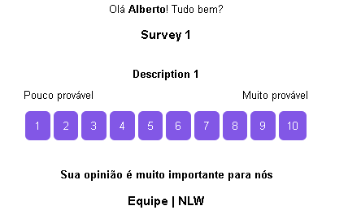

<div align="center">
  <p>Project developed during the Nodejs trail in 4th edition of Next Level Week, created by Rocketseat.</p>
</div>

## Rest API for NPS (Net Promoter Score)

  
  
  
  

This project is a back-end application that consists of calculating the company's NPS. In it, we register users, register surveys, send e-mail to users to answer satisfaction surveys and with this we can perform the NPS calculation.

The Net Promoter Score is a type of metric created to measure customer satisfaction, as: "From 0 to 10, how much you recommend our company?"

<div align="center">
  
</div>

## Technologies and tools used:

- Typescript
- Nodejs
- Express
- SQLite
- TypeORM (data manipulation)
- Nodemailer (sending survey email)
- Handlebars

## How to run the project?

```bash
# Clone this repository
$ git clone https://github.com/VictorMagalhaesSales/express-nps-calculator

# Access the repository on your terminal
$ cd express-nps-calculator

# Install dependencies
$ npm install

# Run
$ npm run dev

# The API will be running on port 3333
```
<hr>
